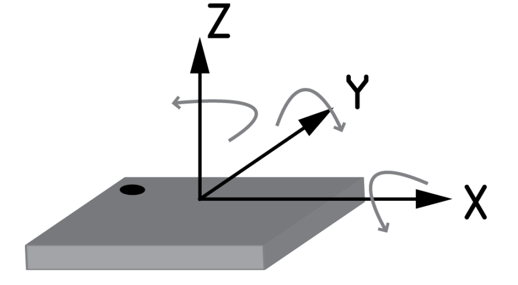
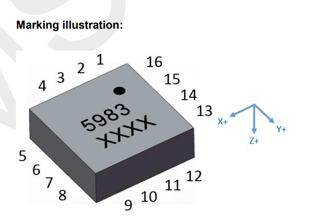

# Kalman Filters Sensor Documentation

This is the README for the sensors used on MIDAS and MIDAS Mini.

## MIDAS Sensors

### GPS (MAX-M10S):

https://content.u-blox.com/sites/default/files/MAX-M10S_DataSheet_UBX-20035208.pdf

- Units: Altitude (m), Latitude/Longitude (deg)
- Noise (Altitude): 1.5m
- Noise (Latitude/Longitude): 0.3deg

### IMU (KX134-1211):

https://www.rohm.com/products/sensors-mems/accelerometer-ics/kx134-1211-product

- Reference Frame: IMU reference frame is NOT rotated. It matches exactly with MIDAS's reference frame so we keep it as such.
  
- Accel ($\frac{m}{s^2}$): RMS Noise is 1.6mg. Noise density is 300 $\frac{ug}{Hz}$
- Noise varies with ODR, power mode, and the Average Filter Control (AVC) settings. Measured with RES = 1, ODR = 50Hz, LPRO = 1, GSEL = 0 settings

### Magnetometer (BNO086):

https://www.oakchina.cn/wp-content/uploads/2022/05/BNO080_085-Datasheet.pdf

- Units: µTesla
- Reference frame: . We rotate this to match with our rocket's frame. X -> -X, Y -> Y, Z -> -Z (NOT IMPLEMENTED YET)
- Noise: 1.4uT

### Barometer (MS5611-01BA03):

https://www.te.com/commerce/DocumentDelivery/DDEController?Action=srchrtrv&DocNm=MS5611-01BA03&DocType=Data+Sheet&DocLang=English

- Units: converted to meters with altitude function
- Noise (Resolution): 0.1m

### Gyroscope (BNO086):

https://www.oakchina.cn/wp-content/uploads/2022/05/BNO080_085-Datasheet.pdf

- Units: Angular velocity (rad/s), Roll Pitch Yaw (deg)
- Yaw: The yaw is a measure of the rotation around the Z-axis since reset. The yaw has a range of +/- 180˚ and is
  provided in 0.01˚ increments, i.e. a report of 8734 is equivalent to 87.34˚.
- Pitch: The pitch is a measure of the rotation around the Y-axis. The pitch has a range of +/- 90˚ and is provided in
  0.01˚ increments, i.e. a report of 1072 is equivalent to 10.72˚.
- Roll: The roll is a measure of the rotation around the X-axis. The roll has a range of +/- 180˚ and is provided in
  0.01˚ increments, i.e. a report of 1072 is equivalent to 10.72˚.
- Reference frame: . We rotate this to match with our rocket's frame. X -> -X, Y -> Y, Z -> -Z (NOT IMPLEMENTED YET)
- To determine the actual orientation of the module, the rotations should be applied in the order yaw, pitch then roll.
- Noise (Angular Velocity): 3.1 deg/s
- Noise (Roll Pitch Yaw from Rotation Vector): 3.5 deg

## MIDAS Mini Sensors

### Accelerometer (LSM6DSV320X):

https://www.st.com/resource/en/datasheet/lsm6dsv320x.pdf

- Reference Frame: IMU reference frame is NOT rotated. It matches exactly with MIDAS Mini's reference frame so we keep it as such. Circle on MIDAS MINI is at bottom left.
  
- Accel low-g Noise Density High Perfomance($\frac{ug}{\sqrt{Hz}}$): 60
- Accel high-g Noise Density High Perfomance($\frac{ug}{\sqrt{Hz}}$): 1000
- Accel low-g Noise Density Normal Perfomance($\frac{ug}{\sqrt{Hz}}$): 100
- Accel RMS Noise Low Power Mode 1,2,3 (mg RMS): 2.7, 2.1, 1.5

### Magnetometer (MMC5983MA):

https://www.memsic.com/Public/Uploads/uploadfile/files/20220119/MMC5983MADatasheetRevA.pdf

- Reference frame: We must modify this reference frame to match the IMU. Circle is at bottom left on MIDAS Mini, so we set X = Y, Y = -X, Z = -Z 
- Total RMS Noise (mG): BW =00, 0.4mG, BW= 01, 0.6 mG, BW = 10, 0.8mG, BW = 11, 1.2 mG

### Barometer (MS5611-01BA03):

https://www.te.com/commerce/DocumentDelivery/DDEController?Action=srchrtrv&DocNm=MS5611-01BA03&DocType=Data+Sheet&DocLang=English

- Units: converted to meters with altitude function
- Noise (Resolution): 0.1m

### GPS (SAM-M10Q):

https://content.u-blox.com/sites/default/files/documents/SAM-M10Q_DataSheet_UBX-22013293.pdfhttps://content.u-blox.com/sites/default/files/documents/SAM-M10Q_DataSheet_UBX-22013293.pdf

- Units: Altitude (m), Latitude/Longitude (deg)
- Noise (Altitude): 1.5m
- Noise (Latitude/Longitude): 0.3deg
